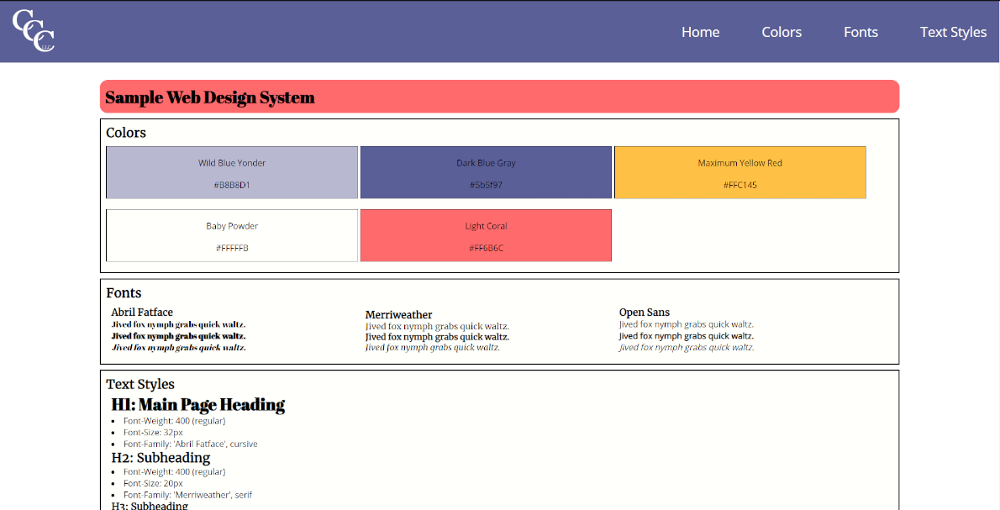

# Chris DeCleene's Website Design System
> Here is my sample website design system. I built this as part of the Full Stack Engineer Career Path on [Codecademy](https://www.codecademy.com/learn). I plan to continue updating as I learn more in my coursework. I will also be using this project as a template for all future website development projects. It is a great way to keep styling consistent and have a reference as the project grows. Feel free to use this on your own projects as well! Happy Coding!

## Table of Contents
* [General Info](#general-information)
* [Technologies Used](#technologies-used)
* [Features](#features)
* [Screenshots](#screenshots)
* [Setup](#setup)
* [Project Status](#project-status)
* [Room for Improvement](#room-for-improvement)
* [Acknowledgements](#acknowledgements)
* [Contact](#contact)
<!-- * [License](#license) -->

## General Information
- Project created as part of the Full Stack Engineer Career Path on [Codecademy](https://www.codecademy.com/learn)
- The Website Design System is used to easily keep track of the sites styling as the project grows.
- I will be using this as a template for future websites.
- This specific example is available for others to use.

## Technologies Used
     

## Features
- Hamburger Menu for mobile devices
- Fixed position header

## Screenshots

## Setup
- Live-version of the project can be found @ https://chrisdecleene.github.io/SampleWebDesignSystem/
- Project is available on [GitHub](https://github.com/ChrisDeCleene/SampleWebDesignSystem.git)

## Project Status
Project is: _in progress_

## Room for Improvement

Room for improvement:
- Box overlap in the #colors section.
- Footer styling is rigid. Needs better spacing.

To do:
- Move each style to it's own page.
- Add additional styling sections. I.e. Box Styling.
- Improve accessibility.
- Improve mobile responsive.

## Acknowledgements
Give credit here.
- This project was inspired by [Codecademy](https://www.codecademy.com/)
- This project was based on [this tutorial](https://www.example.com).

## Contact
Created by [Chris DeCleene](https://chrisdecleene.github.io/) - feel free to contact me!

<!-- Optional -->
<!-- ## License -->
<!-- This project is open source and available under the [... License](). -->